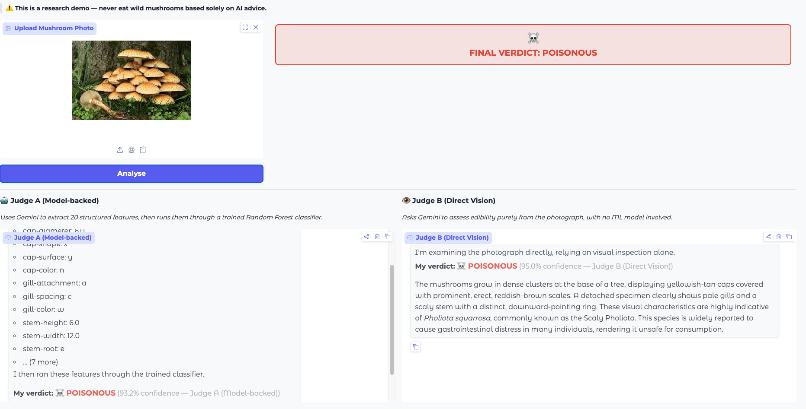

# Milestone 1 — Agent-Driven Mushroom Detection: Design & Verification

## Overview

We implemented and verified an end-to-end Gemini-powered mushroom safety application, establishing the applicability of multi-agent LLM pipelines for structured biological classification tasks.

## System Design

```
User uploads photo
        │
        ├──────────────────────────────────┐
        ▼                                  ▼
  Judge A (Model-backed)           Judge B (Direct Vision)
  Gemini extracts 20 features      Gemini assesses photo directly
        │                                  │
  RandomForest classifier                  │
  (trained on 61k samples)                 │
        │                                  │
  verdict + confidence             verdict + confidence
        └──────────────┬───────────────────┘
                       ▼
           Weighted consensus (60/40)
                  Final Verdict
```

### Modular components

| Module | Role |
|---|---|
| `src/data/preprocessor.py` | Parses both CSV formats (ranges `[lo,hi]` and plain values); OrdinalEncoder fitted once, persisted |
| `src/models/base_learner.py` | RandomForest + isotonic calibration; tunable via class constants |
| `src/agents/gemini_extractor.py` | Gemini Vision → structured 20-feature JSON |
| `src/judges/model_judge.py` | Judge A: features → classifier → narrative |
| `src/judges/direct_judge.py` | Judge B: direct visual verdict, no ML |
| `app.py` | Gradio UI wiring both judges side-by-side |
| `config/api_keys.py` | Gitignored key file; `api_keys.example.py` as template |

## Contributions

1. **Dual-judge architecture** — separates the structured-feature ML path from the end-to-end LLM path, enabling direct A vs. B comparison as proposed.

2. **Heterogeneous CSV parsing** — primary data uses `[lo, hi]` bracket ranges and multi-value categoricals `[x, f]`; secondary data uses plain semicolon-delimited values. A single preprocessor handles both transparently.

3. **Calibrated classifier** — `CalibratedClassifierCV(isotonic)` produces reliable confidence percentages shown in the UI, not just argmax labels.

4. **API key security** — `config/api_keys.py` is gitignored from the first commit; a committed example template documents the format.

5. **Gradio 6 compatibility** — resolved breaking changes in `gr.Chatbot` (removed `type` and `bubble_full_width` args; messages format uses `{"role", "content"}` dicts; `theme` moved to `launch()`).

## Verification

The screenshot below shows a successful end-to-end run on a photo of *Pholiota squarrosa* (Scaly Pholiota):



- **Judge A** extracted 17 features (cap-diameter, cap-shape, cap-surface, gill-color, stem dimensions, etc.) and the classifier returned **POISONOUS at 93.2% confidence**
- **Judge B** independently identified the yellowish-tan scaly caps, pale gills, and ringed stem as characteristic of *Pholiota squarrosa* — **POISONOUS at 95.0% confidence**
- **Final verdict: POISONOUS** (weighted consensus 60/40)

Both judges agreed, and Judge B's species identification matches the botanical record — confirming the pipeline is functionally correct.


# Active Learning Part Progress

This project investigates **active learning** as a strategy for training a mushroom edibility classifier (edible vs. poisonous) with minimal labeled data. The core research question is how much annotation effort active learning can save compared to random labeling.

---

## 1. Data Preprocessing

### Step 1: Handle Missing Values
All NaN values are treated as a "missing" category.

```python
pool_data = pool_data.fillna('missing')
```

### Step 2: Separate Target and Features

```python
y = pool_data['class'].map({'e': 0, 'p': 1})
X = pool_data.drop(columns=['class'])
```

### Step 3: Label Encoding

Numeric columns kept as-is; categorical columns label-encoded.

```python
numeric_cols = ['cap-diameter', 'stem-height', 'stem-width']
categorical_cols = [col for col in X.columns if col not in numeric_cols]

for col in categorical_cols:
    le = LabelEncoder()
    X[col] = le.fit_transform(X[col].astype(str))
```

---

## 2. Initial Training Set Selection

Two initialization strategies implemented:

| Strategy | Method | Samples |
|----------|--------|---------|
| Random | Stratified random sampling | 200 |
| D-Optimal | Maximize det(X'X) for feature space coverage | 200 |

### D-Optimal Implementation

```python
def d_optimal_initialization(X, n_init=200):
    scaler = StandardScaler()
    X_scaled = scaler.fit_transform(X)
    
    selected = []
    remaining = set(range(len(X_scaled)))
    
    # Start with point furthest from origin
    norms = np.linalg.norm(X_scaled, axis=1)
    first_idx = np.argmax(norms)
    selected.append(first_idx)
    remaining.remove(first_idx)
    
    # Greedily add points that maximize det(X'X)
    for i in range(n_init - 1):
        best_idx, best_det = None, -np.inf
        X_selected = X_scaled[selected]
        
        candidates = list(remaining)
        if len(candidates) > 1000:
            candidates = np.random.choice(candidates, 1000, replace=False)
        
        for idx in candidates:
            X_candidate = np.vstack([X_selected, X_scaled[idx]])
            XtX = X_candidate.T @ X_candidate
            _, logdet = np.linalg.slogdet(XtX)
            if logdet > best_det:
                best_det, best_idx = logdet, idx
        
        selected.append(best_idx)
        remaining.remove(best_idx)
    
    return np.array(selected)
```

---

## 3. Base Classifiers

Three classifiers defined:

| Model | Configuration |
|-------|---------------|
| Logistic Regression | max_iter=1000 |
| Random Forest | n_estimators=100 |
| Neural Network (MLP) | hidden_layers=(128, 64), max_iter=500 |

---

## 4. Active Learning Loop design

Implemented with cross-validation accuracy as the evaluation metric.

**Configuration:**
- Batch size: 50
- Stopping criterion: CV accuracy ≥ target (e.g., 95%)

```python
def Active_learning(model, X_initial, y_initial, X_pool, y_pool,
                    query_strategy, batch_size=50, target_accuracy=0.95, cv=5):
    X_labeled = X_initial.copy().reset_index(drop=True)
    y_labeled = y_initial.copy().reset_index(drop=True)
    X_unlabeled = X_pool.copy().reset_index(drop=True)
    y_unlabeled = y_pool.copy().reset_index(drop=True)
    
    results = []
    
    while len(X_unlabeled) >= batch_size:
        cv_scores = cross_val_score(model, X_labeled, y_labeled, cv=cv, scoring='accuracy')
        cv_accuracy = cv_scores.mean()
        
        results.append({'labels': len(y_labeled), 'cv_accuracy': cv_accuracy, 'cv_std': cv_scores.std()})
        
        if cv_accuracy >= target_accuracy:
            print(f"Target accuracy {target_accuracy:.0%} reached!")
            break
        
        query_indices = query_strategy(X_unlabeled, batch_size)
        
        X_labeled = pd.concat([X_labeled, X_unlabeled.iloc[query_indices]], ignore_index=True)
        y_labeled = pd.concat([y_labeled, y_unlabeled.iloc[query_indices]], ignore_index=True)
        X_unlabeled = X_unlabeled.drop(query_indices).reset_index(drop=True)
        y_unlabeled = y_unlabeled.drop(query_indices).reset_index(drop=True)
    
    return results
```

---

## 5. Query Strategy: Random Sampling

Implemented random sampling as the baseline strategy.

```python
def random_sampling(X_pool, n_samples=50):
    indices = np.random.choice(len(X_pool), n_samples, replace=False)
    return indices
```

---

## 6. Preliminary Results

Tested Random Forest with random sampling:

```python
result = Active_learning(
    model=RF,
    X_initial=X_initial,
    y_initial=y_initial,
    X_pool=X_pool,
    y_pool=y_pool,
    query_strategy=random_sampling,
    batch_size=50,
    target_accuracy=0.97,
    cv=5
)
# Output: Target accuracy 97% reached!
```

---

## 7. Next Steps

- Implement remaining query strategies: Uncertainty, Query-by-Committee, BALD
- Run experiments across all classifier and strategy combinations
- Generate learning curves and compare label efficiency
